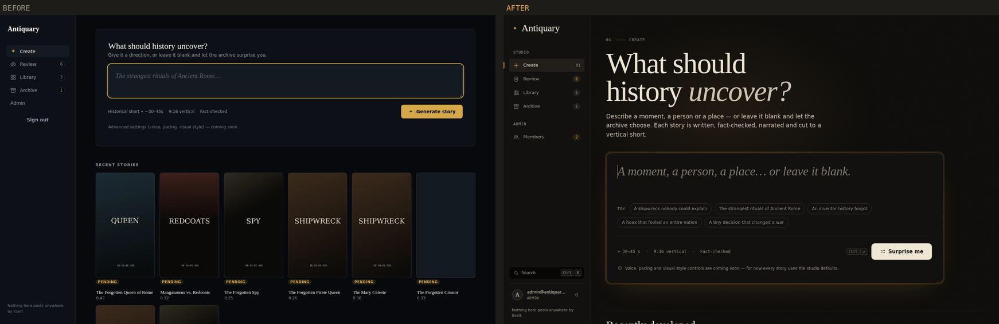
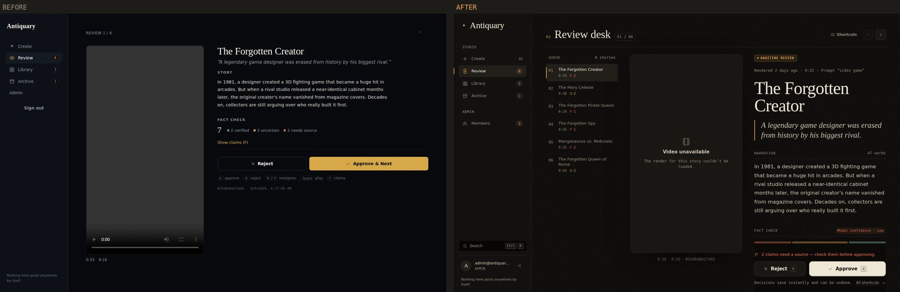
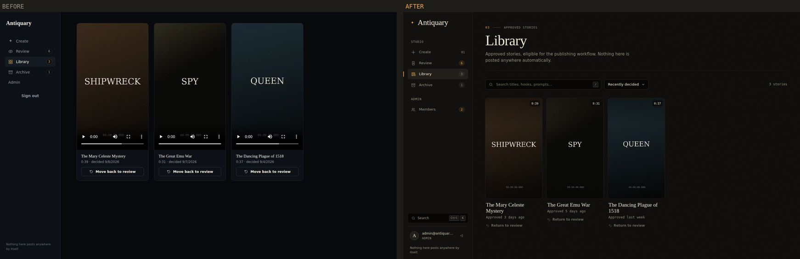
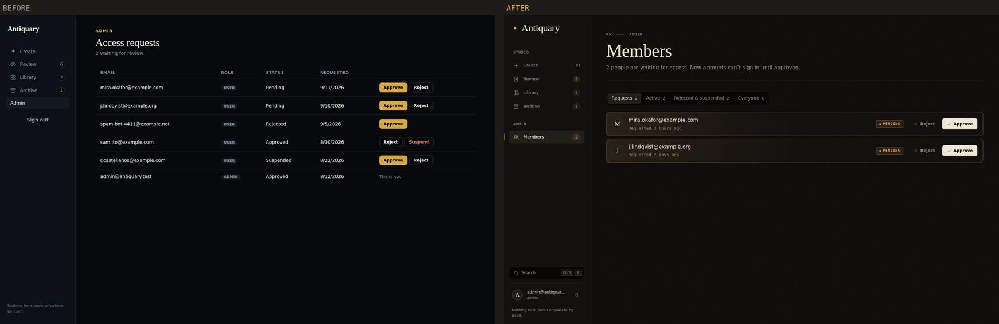
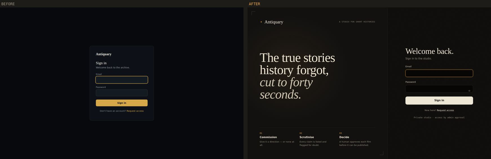
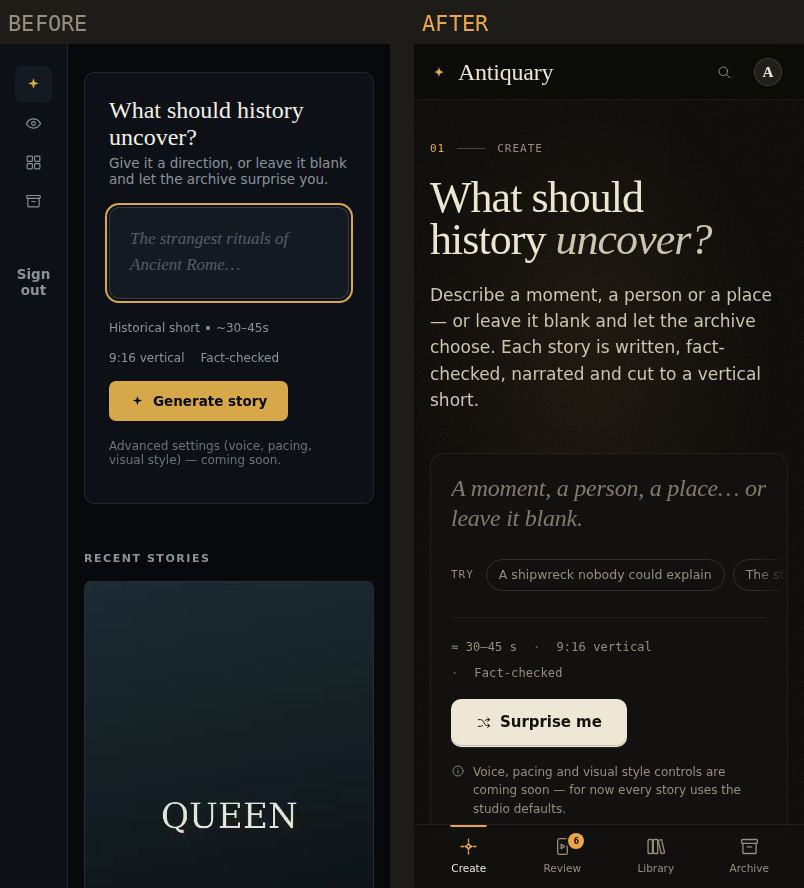
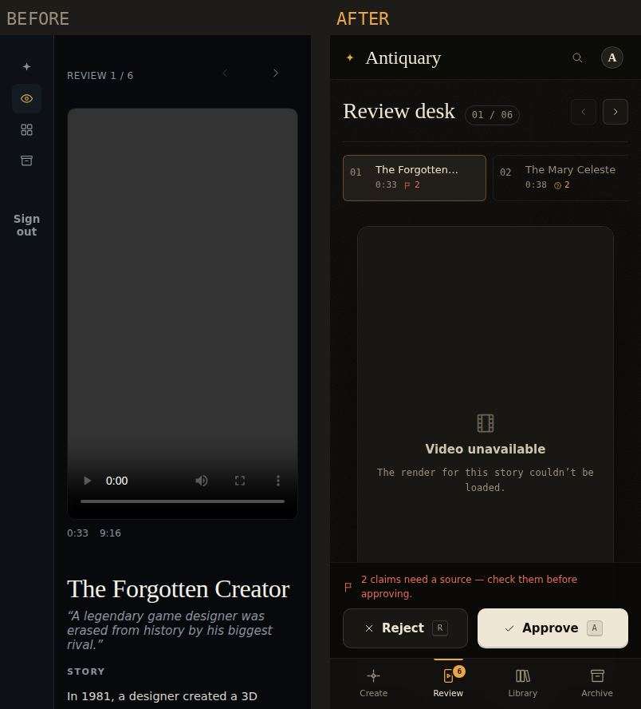
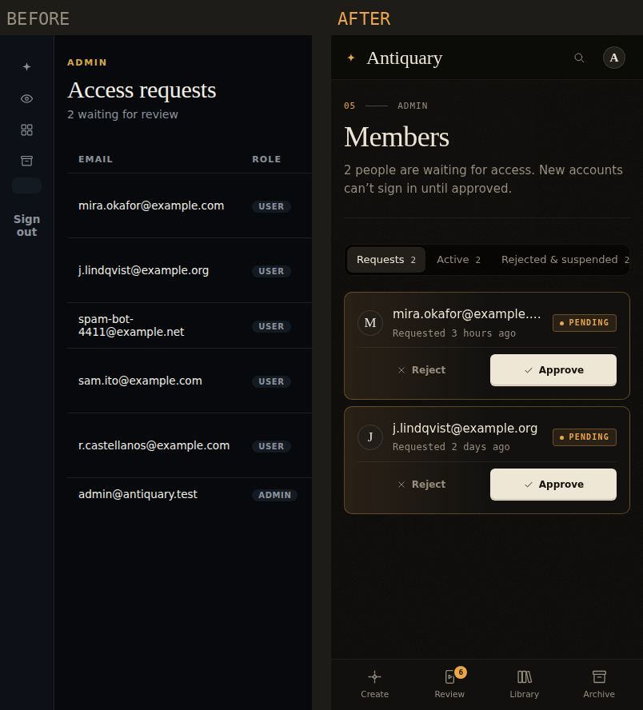

# Antiquary — UI/UX Redesign Review

*A case study of the full frontend overhaul on branch `redesign/ui-ux-overhaul`.*

> **Status:** implemented and tested against a mock of the real API; not yet deployed.
> Nothing in `app/`, `pipeline/`, the API contract, the database or the deploy workflow
> changed. See [Remaining issues](#15-remaining-issues) before merging to `main`
> (merging deploys automatically).

---

## Contents

1. [Executive summary](#1-executive-summary)
2. [Product understanding](#2-product-understanding)
3. [Existing UX audit](#3-existing-ux-audit)
4. [Research and inspiration](#4-research-and-inspiration)
5. [Design direction](#5-design-direction)
6. [Before vs after](#6-before-vs-after)
7. [Design system](#7-design-system)
8. [UX improvements](#8-ux-improvements)
9. [Animation and interaction specification](#9-animation-and-interaction-specification)
10. [Responsive strategy](#10-responsive-strategy)
11. [Accessibility](#11-accessibility)
12. [Performance](#12-performance)
13. [Technical changes](#13-technical-changes)
14. [How this was verified](#14-how-this-was-verified)
15. [Remaining issues](#15-remaining-issues)
16. [Future improvements](#16-future-improvements)
17. [Final design rationale](#17-final-design-rationale)

---

## 1. Executive summary

**What Antiquary is.** A private, self-hosted studio that turns a short prompt (or no
prompt at all) into a 30–45 second vertical film about a narrow, surprising, true moment
in history. A local LLM writes the script, a second pass lists and doubts its claims,
the pipeline sources archival imagery, narrates, captions and renders it — and then a
human reviews every film before it becomes eligible for publishing. Access is by admin
approval only.

**What was wrong.** The old interface had the right instincts (honest progress, keyboard
shortcuts, no fake settings) but the experience didn't hold up:

- The single most important screen — the review desk — let **Cmd/Ctrl+R reject a story
  and Ctrl+A approve one**, offered **no undo**, hid the queue, and presented a small
  model's self-check as "verified" fact.
- Story "thumbnails" rendered as **empty dark rectangles** everywhere (a `<video>` with no
  poster frame), so the product never showed its own output.
- **Mobile was broken**: the admin link vanished, the members table forced the page to
  scroll sideways, and the Create page became a 5,300 px column of blank boxes.
- Loading, empty and error states were mostly `return null`: blank screens, silent
  failures, and no confirmation after signing up.
- Visually it was a generic dark dashboard: blue-black, gold accent, the very common
  Fraunces + Inter pairing, 13.5 px text and little hierarchy.

**What the redesign does.** It rebuilds every screen around one idea — *Antiquary is a
screening room for short histories* — and around the job that actually matters: a person
deciding, quickly and carefully, whether a machine-written film is true enough to publish.

**Design philosophy.** Editorial, archival and cinematic — but a working tool first. Warm
darkroom surfaces, a title-card serif for the stories themselves, a catalogue mono for
metadata, and exactly one signal colour that always means "this needs a human eye".
Motion only where it communicates state. No new dependencies.

---

## 2. Product understanding

### 2.1 Purpose

Produce short-form historical films at zero running cost (local Ollama, edge-tts,
faster-whisper, ffmpeg, Postgres, MinIO, Caddy) without publishing hallucinations. The
human review step is load-bearing, not a formality — `CLAUDE.md` is explicit that the
fact-check pass is the same small model checking itself.

### 2.2 Users

| User | Context | What they need most |
|---|---|---|
| **Studio owner / admin** | Runs the server, approves members, reviews most stories. Power user, on desktop and phone. | A fast, trustworthy review desk; visibility of what's rendering; member approvals without friction. |
| **Approved member** | Commissions stories and reviews them. May be occasional. | A clear "type a prompt, get a film" flow; knowing when it's done; confidence about what to approve. |
| **Applicant** | Has just requested access. | To know the request was received and what happens next. |

### 2.3 Core use cases and journeys (as actually implemented)

```
Onboarding   Request access → (admin approves) → Sign in → Create
Commission   Create → prompt or blank → Generate → 6 real stages → done → Review
Review       Review desk → watch · read narration · read flagged claims → Approve / Reject
             → next story → (Undo) → queue clear
Curate       Library / Archive → search → story → Return to review
Administer   Members → requests → Approve / Reject; Active → Suspend / Revoke; Reinstate
```

### 2.4 Most important actions and information

1. **Approve / reject** a story — the product's reason to exist.
2. **Flagged claims** ("needs a source", "uncertain") and the model's own confidence.
3. The **film itself**, its hook and narration.
4. **Start a generation**, and know its **real stage** from anywhere.
5. **Approve access requests**.

### 2.5 Information architecture

**Before:** Create · Review · Library · Archive · Admin (text link, no icon) — no way to
open a single story, no global status.

**After:**

```
Studio      01 Create        prompt composer · live "Developing" panel · recently developed
            02 Review        queue · player · dossier (narration + fact check) · decision bar
            03 Library       approved: search · sort · posters
            04 Archive       rejected: search · sort · posters
            /stories/:id     any story at its own URL (new)
Admin       Members          Requests · Active · Rejected & suspended · Everyone
Global      ⌘K command menu · generation widget · toasts · keyboard shortcuts sheet
Account     Sign in · Request access · Account status
```

Routes are unchanged except for the new `/stories/:id`; every existing URL still works.

---

## 3. Existing UX audit

The audit was done on the live site (signed in as admin, every screen, desktop and a
390 px mobile viewport) and by reading every file in `frontend/src` and the Flask routes
it calls. Severity: **Critical** — can cause a wrong, hard-to-reverse outcome;
**High** — blocks or seriously degrades a core task; **Medium** — friction or confusion;
**Low** — polish.

### 3.1 Global shell and navigation

| # | Current experience | Problem | Severity | Why it matters | Recommendation (implemented) |
|---|---|---|---|---|---|
| G1 | Below 880 px the sidebar collapses to a 68 px icon rail and hides labels. | **The Admin link has no icon, so it disappears entirely**; "Sign out" wraps into two lines. | High | Admins can't approve members from a phone. | Real mobile navigation: top bar + bottom tab bar + account sheet with Members. |
| G2 | Pages render `null` while loading; `AuthProvider` has no `.catch`. | Blank screens; if `/api/auth/me` fails (e.g. during a deploy restart) the app is blank **forever**. | Medium | Feels broken; no recovery. | Splash, skeletons per page, an "unreachable — try again" state, error states with retry. |
| G3 | Mutations (`decide`, `restore`, `startGeneration`, `cancel`, member status) have no error handling. `startGeneration` returning `{started:false}` is ignored. | Failures are silent; "already running" looks like the button did nothing. | Medium | Users can't tell whether a decision saved. | Every mutation reports success or failure in a toast; start refusals are explained. |
| G4 | Generation status only exists on the Create page. | A render in progress is invisible from Review/Library. | Medium | One job runs globally; everyone needs to see it. | `GenerationContext` + sidebar widget / top-bar pill on every page, completion toast. |
| G5 | Identity isn't shown; sign-out floats mid-rail. | Unclear which account is signed in. | Low | Multi-user app. | Account block (avatar initial, email, role) and sign-out at the foot of the sidebar. |
| G6 | Every tab is titled "Antiquary"; no skip link; focus isn't moved on navigation. | Hard to use with many tabs or a screen reader. | Low | Accessibility and orientation. | Per-page titles (`Review (6) · Antiquary`), skip link, focus moves to the page heading. |

### 3.2 Create

| # | Current experience | Problem | Severity | Why it matters | Recommendation (implemented) |
|---|---|---|---|---|---|
| C1 | "Recent stories" is a grid of `<video preload="metadata">`. | **Browsers don't paint a first frame**, so every card is an empty dark rectangle (confirmed live: 7 blank cards). On mobile each is full-width — a 5,300 px page. | High | The product never shows its own output; cards are unscannable. | `StoryPoster`: first frame via `#t=0.1`, lazy loading, skeleton → fade-in, duration/status/flag overlays, hover preview, 2-column grid on phones. |
| C2 | Approved/rejected recent cards link to `/library` or `/archive`. | You land on a list, not the story you clicked. | Medium | Broken expectation. | New `/stories/:id` page; pending stories open in the review desk at that item. |
| C3 | When a generation finishes, the form silently reappears. | No "your story is ready" moment and no link to it. | Medium | The payoff of a multi-minute wait is invisible. | Completion toast from any page with **Review** action, plus a dismissible "latest story is ready" callout on Create. |
| C4 | "Stop" cancels immediately. | A mis-tap throws away minutes of CPU-bound work. | Low | Irreversible. | Confirmation dialog explaining what is discarded. |
| C5 | A blank prompt and a written prompt share one "Generate story" button; "leave it blank" is only a hint line. | The blank-prompt feature is easy to miss. | Low | It's a headline feature. | The button reads **Surprise me** when empty and **Generate story** otherwise; prompt ideas as chips; ⌘/Ctrl+Enter. |
| C6 | The error banner prints the raw log tail inline until the next run. | A traceback wall on the main screen. | Low | Intimidating. | Plain-language summary, dismissible, technical details in a disclosure. |

What was strong and kept: **real** staged progress (not a timer), and the honest "coming
soon" note instead of fake settings.

### 3.3 Review desk

| # | Current experience | Problem | Severity | Why it matters | Recommendation (implemented) |
|---|---|---|---|---|---|
| R1 | A `keydown` listener checks only `e.key`. | **Cmd/Ctrl+R (reload) rejects the current story; Ctrl+A (select all) approves it**; Space fires even when a button has focus. | **Critical** | Common browser chords make editorial decisions. | `useHotkeys` ignores modifier chords, auto-repeat, typing targets and open dialogs; Space defers to focused controls. |
| R2 | After a decision the story disappears. Restore exists only inside Library/Archive. | No undo; a misclick means hunting through another page. | High | Speed and safety pull against each other without undo. | Every decision shows an **Undo** toast that restores the story to the same queue position. |
| R3 | Fact check shows a lone "7", then "5 verified · 2 uncertain · 0 needs source"; claims hidden behind "Show claims (F)". `overall_confidence` from the API is never shown. | The big number is unlabeled; the reviewer must click to see *which* claims are doubtful; "verified" reads as ground truth although it's the model checking itself. | High | This is the information the decision depends on. | Flagged claims first and always visible; proportional bar + labelled legend; model confidence badge; "verified" renamed **nothing flagged**; explicit caveat; warning above the buttons when claims need a source. |
| R4 | "REVIEW 1 / 6" and two chevrons. | The queue itself is invisible; you can't see what's next or jump. | Medium | Reviewing is a batch task. | Queue column (desktop) / horizontal strip (tablet, phone) with per-story flags. |
| R5 | `?item=` is read once on load. | The URL doesn't follow the current story; reloading loses your place. | Medium | Linkability, reload safety. | URL always reflects the current story; external changes (command menu) select it. |
| R6 | Empty state uses `<a href="/create">`. | Full page reload. | Low | Speed. | Router links; empty state mentions a story that is still developing. |

### 3.4 Library and Archive

| # | Current experience | Problem | Severity | Why it matters | Recommendation (implemented) |
|---|---|---|---|---|---|
| L1 | A bare grid of native video players; no page title or description. | Not obvious which page you're on; every card loads a player through Flask. | Medium | Orientation and performance. | Page header with purpose, search (`/`), sort, counts, lazy posters. |
| L2 | No way to read a decided story's narration or fact check. | Re-evaluating means restoring it to the queue first. | Medium | Curating needs context. | Story detail page. |
| L3 | "Move back to review" acts instantly with no feedback. | Unclear it worked; no way back. | Low | Safety. | Toast with Undo (re-applies the original decision). |

### 3.5 Admin (Access requests)

| # | Current experience | Problem | Severity | Why it matters | Recommendation (implemented) |
|---|---|---|---|---|---|
| A1 | A 5-column table. | Overflows to 719 px on a 390 px phone. | High | Admin on the go is a real need. | Card rows that restack; full-width actions on phones. |
| A2 | Pending requests are mixed in with everyone. | The actionable rows aren't separated. | Medium | The page's job is approving requests. | Tabs with counts: Requests (default when non-empty) · Active · Rejected & suspended · Everyone. |
| A3 | Suspend/Reject apply instantly; no feedback or errors; "Reject" on an approved member uses request wording. | Affects someone else's access with one click and no confirmation. | Medium | Consequential for another person. | Confirmation for Suspend/Revoke, Undo toast for everything, clearer verbs (Revoke, Reinstate). |

### 3.6 Authentication

| # | Current experience | Problem | Severity | Why it matters | Recommendation (implemented) |
|---|---|---|---|---|---|
| AU1 | Signup navigates to `/login` with `state.justSignedUp`, which Login never reads. | **No confirmation that the request was sent.** | Medium | Applicants will re-submit or give up. | "Request sent" confirmation on the sign-in page, email prefilled. |
| AU2 | `ProtectedRoute` redirects to `/login` without `state.from`, while Login reads `state.from`. | Deep links (e.g. `/review?item=…`) are lost after signing in. | Medium | Shared links break. | Destination is preserved and restored after sign-in. |
| AU3 | Signed-in users still see `/login`/`/signup`; `/pending` offers "Sign out" to signed-out visitors (which 401s). | Dead ends. | Low | Confusing. | Redirects for signed-in users; status page offers "Back to sign in" when signed out; sign-out never strands the user even if the session already expired. |
| AU4 | No password reveal, no `autocomplete` hints, validation only on submit. | Password-manager friction, late errors. | Low | Polish and accessibility. | Show/hide toggle, `autocomplete` attributes, live length hint, inline mismatch. |

### 3.7 Visual audit

- **Palette:** cool blue-black (`#07090D`) with a gold accent — the default look of dark
  dashboards, and at odds with the warm, archival subject.
- **Type:** Fraunces + Inter is one of the most common "tasteful default" pairings; body
  copy at 13.5 px felt cramped; hierarchy relied on tiny uppercase labels.
- **Output invisible:** blank posters meant the most distinctive asset — the films — never
  appeared.
- **Density and rhythm:** inconsistent spacing between pages, 10 px radii everywhere,
  borders doing all the work.

### 3.8 What would have prevented it from feeling premium

Blank media, blank loading screens, a broken phone layout, silent failures, and an
interface that could make a decision because the user pressed reload.

---

## 4. Research and inspiration

Sources were chosen for the three things Antiquary is: a **review/triage tool**, a
**video product**, and an **archival/editorial publication**. Some pages were read during
this project (marked *read*); others are products studied from long familiarity (marked
*familiar*) — noted so the provenance is honest.

| Reference | What I studied | Principle extracted | How it shaped Antiquary | Deliberately not copied |
|---|---|---|---|---|
| **Linear — Triage** ([docs](https://linear.app/docs/triage), *read*) | Accept / decline an incoming item with single keys; the queue advances; universal URLs for every item. | A queue is processed one item at a time with the keyboard, and every item has a URL. | Review desk: A/R decide and advance, J/K move, queue column, `?item=` always in sync, `/stories/:id`. | Linear's dense list-first layout — a film needs to be watched, so the player is central. |
| **Linear's interaction patterns** ([Gunpowder Labs write-up](https://gunpowderlabs.com/2024/12/22/linear-delightful-patterns), *read*) | Command palette, keyboard-first design, triage queue and snooze. | Make every action reachable from ⌘K; keep the fast path keyboard-only — which only works if a slip is cheap, so pair it with reversibility. | Command menu (pages, actions, story search), "g then key" navigation, Undo toasts instead of "are you sure?" dialogs. | Natural-language filters and AI features — no substance to back them here. |
| **Video review & approval tools** — Frame.io and peers ([The Post Flow comparison](https://thepostflow.com/post-production/video-editing/video-review-approval-tools/), *read*; Frame.io *familiar*) | Player-centric layouts, explicit approval states, notes beside the video. | The player is the hero; status is always visible; notes sit next to what they describe. | Three-pane desk (queue · player · dossier), status stamps, fact-check claims beside the film. | Frame-accurate comments and version stacks — the pipeline has no versions or timecoded notes, and faking them would violate the project's "no fake UI" rule. |
| **The Public Domain Review** ([site](https://publicdomainreview.org/), *read*) | Scholarly-but-accessible editorial layout; serif reading with small secondary metadata; dates and provenance as a visual element. | Archival credibility comes from typography and metadata discipline, not ornament. | Serif titles and hooks, mono "catalogue" metadata (IDs, durations, dates), numbered sections (01 Create … 04 Archive), status as stamps. | Its light, paper-white page — Antiquary is about watching films, which wants a dark room. |
| **The Criterion Channel** (*familiar*) | Dark, restrained cinematic browsing; posters as the primary navigation; typography over chrome. | Let the films carry colour; keep the interface quiet around them. | Poster grids with real first frames, warm neutral chrome, a single accent. | Autoplaying hero banners and carousels — spectacle over task. |
| **Vercel / Geist** (*familiar*) | Hairline borders, restrained toasts, a sans and mono designed as a pair. | Precision details (1 px lines, tabular numbers, mono metadata) read as quality. | Geist + Geist Mono, hairline system (`--line`, `--line-strong`), toast styling. | The monochrome black-and-white brand; Antiquary needs warmth. |
| **Raycast** (*familiar*) | Command-menu anatomy: grouped results, key hints, footer legend. | Show the keys inside the UI so power features teach themselves. | Command menu groups, footer legend, `kbd` hints on buttons and the shortcuts sheet. | Extension marketplace metaphors. |
| **Film leader, darkroom and archive stamps** (visual culture, *familiar*) | Rubber approval stamps, crop marks, tungsten light, grain. | Borrow texture only where it carries meaning. | "Approved/Rejected" stamp micro-interaction, a tungsten glow on the prompt, static film grain, crop marks on the sign-in poster. | Sepia filters, fake scratches, vignettes on the actual videos. |

---

## 5. Design direction

### 5.1 Personality

**Archival · editorial · cinematic · precise · quietly confident.**
It should feel like a private screening room attached to a research library: the lights
are low, the films are the brightest thing in the room, and everything else is
typography and good manners.

### 5.2 Mood

Warm darkness (not blue), paper-coloured ink, one lamp of tungsten light. Texture is
limited to a barely-visible static grain on the bare background.

### 5.3 Visual language

- **Title-card serif** (Instrument Serif) for anything that is *a story* or a page title.
- **Geist** for interface and reading, **Geist Mono** for catalogue metadata (IDs,
  durations, counts, dates, stage numbers).
- **Stamps** for status, **numbered sections** for navigation, **hairlines** for structure.
- **Paper** is the primary action colour — editorial and calm, not a brand gradient.
- **Tungsten** is the only accent and has one meaning: *needs a human eye* — pending
  stories, uncertain claims, requests waiting, generation in progress, focus rings.
- **Patina** (verdigris green) and **oxide** (rust red) are borrowed from aged metal for
  verified/approved and flagged/rejected.

### 5.4 Layout and interaction principles

1. **The film is the hero** wherever a story is shown.
2. **Doubt goes first.** Flagged claims are shown before reassuring ones.
3. **Reversible beats confirmable.** Undo toasts for anything reversible; dialogs only
   for actions that affect another person or discard work.
4. **Keyboard parity.** Every frequent action has a key, and the key is shown in the UI.
5. **Global state is global.** A running generation and queue counts are visible everywhere.
6. **Honest UI.** No fake settings, no simulated progress, no "verified" overclaiming.

---

## 6. Before vs after

Screenshots were captured from the old and new builds against the same mock data. They
were rendered in a sandbox that cannot load Google Fonts, so the serif and sans in these
images are fallbacks (DejaVu/Liberation) — the live site uses Instrument Serif and Geist.
The "SHIPWRECK/SPY" frames are placeholder test videos.

**Create** — 
**Review desk** — 
**Library** — 
**Members** — 
**Sign in** — 
**Mobile** —   

| Area | Before | Problem | After | Why |
|---|---|---|---|---|
| **Navigation** | 220 px rail; collapses to icons at 880 px; Admin link vanishes; no identity. | Broken on phones; no global status. | Sidebar with numbered Studio section, Admin section with request count, generation widget, ⌘K search, account block. Phones get a top bar, bottom tab bar with review badge, and an account sheet. | Every destination reachable at every width; state that matters is visible everywhere. |
| **Create** | Card with a textarea, "Generate story", recent grid of blank rectangles. | Output invisible; blank-prompt feature hidden; no completion moment. | Display headline, a composer that writes in the title-card serif, prompt-idea chips, "Surprise me"/"Generate story", ⌘↵, live "Developing" panel with the six real stages, completion callout and toast, real posters. | Commissioning a film should feel like writing its title; the wait should be legible; the result should be seen. |
| **Generation progress** | Stage list with ●/○/✓ glyphs, elapsed timer, instant Stop. | Only on Create; Stop was one click. | Segmented bar + numbered stages with the active step's description, elapsed mono clock, Stop with confirmation; the same stage data drives the sidebar widget and mobile pill. | Honest progress, visible from anywhere, with a safe stop. |
| **Review desk** | 380 px player + text column; "7 · 5 verified…"; claims behind a toggle; unguarded shortcuts; no undo. | Wrong decisions possible via browser chords; the evidence was hidden; no queue. | Queue · player · dossier. Status stamp, provenance line (rendered, duration, prompt), serif title, hook as a pull quote, narration with word count, fact check with flagged claims first, model confidence, caveat, decision bar pinned to the bottom with a flagged-claims warning, stamp animation, Undo. | Fast *and* careful: the evidence is in front of the reviewer and mistakes are one key away from undone. |
| **Library / Archive** | Untitled grid of native players with a restore button. | No context, no search, heavy. | Page header with purpose, search (`/`), five sorts, result count, lazy posters that preview on hover, "Return to review" with Undo, and a click-through to the story. | A collection you can find things in. |
| **Story detail** | — (didn't exist) | Decided stories couldn't be read. | Player + full dossier + status-appropriate actions, breadcrumb, shared-element transition from the poster. | Every story gets a stable, shareable URL. |
| **Members** | Table of all users with inline buttons. | Overflowed on phones; requests not separated; one-click suspend. | Tabs with counts, card rows with avatar, relative dates, stamps, context-appropriate verbs (Approve, Reject, Revoke, Suspend, Reinstate), confirmation for Suspend/Revoke, Undo. | The actionable work comes first, and changes to someone's access are deliberate. |
| **Auth** | Centered 380 px card. | No post-signup confirmation; deep links lost; no password reveal. | Split layout: an editorial poster explaining the studio (commission → scrutinise → decide) beside a focused form; success confirmation, prefilled email, destination restored, reveal toggle, live hints. | First impressions explain the product; forms are forgiving. |
| **States** | `null` while loading, silent errors, "✦" empty states. | Blank or broken-feeling. | Splash, skeletons shaped like the content, retryable error callouts, specific empty states that point to the next action, toasts for every outcome. | The app always tells you what's happening. |

---

## 7. Design system

All tokens live in `frontend/src/styles/tokens.css`. Stylesheets load in order:
`tokens → base → components → shell → pages`.

### 7.1 Typography

| Role | Font | Size | Weight | Line height | Tracking |
|---|---|---|---|---|---|
| Display (Create headline, auth poster) | Instrument Serif | `clamp(2.75rem, 1.55rem + 4.1vw, 5.25rem)` | 400 | 0.96 | −0.022em |
| H1 (page titles) | Instrument Serif | `clamp(2.25rem, 1.75rem + 1.9vw, 3.25rem)` | 400 | 1.02 | −0.016em |
| Story title (dossier) | Instrument Serif | `clamp(2.25rem, 1.6rem + 2.2vw, 3.5rem)` | 400 | 1.0 | −0.018em |
| H2 (sections, dialogs) | Instrument Serif | `clamp(1.625rem, 1.42rem + 0.75vw, 2.125rem)` | 400 | 1.1 | −0.01em |
| Hook / pull quote | Instrument Serif *italic* | `clamp(1.25rem, 1.1rem + 0.5vw, 1.55rem)` | 400 | 1.3 | 0 |
| Composer input | Instrument Serif | `clamp(1.5rem, 1.15rem + 1.3vw, 2.25rem)` | 400 | 1.22 | −0.01em |
| H3 | Geist | 16 px | 600 | 1.3 | −0.005em |
| Lead | Geist | 17 px | 400 | 1.55 | 0 |
| Reading (narration) | Geist | 16.5 px | 400 | 1.72 | 0, max 66ch |
| Body | Geist | 15 px | 400 | 1.55 | 0 |
| Small | Geist | 13 px | 400–560 | 1.5 | 0 |
| Label / eyebrow | Geist Mono | 11 px | 500 | — | 0.09em, uppercase |
| Metadata / numbers | Geist Mono | 12 px | 400 | — | tabular numerals |

Why: a display serif with no bold weight forces hierarchy through *size and space*
rather than weight, which is what gives title cards their calm. The mono is used only for
things you would find on a catalogue card.

### 7.2 Colour

| Token | Value | Use | Contrast on `--bg` |
|---|---|---|---|
| `--bg` | `#0b0a08` | Page | — |
| `--bg-sunken` | `#070605` | Inputs, wells | — |
| `--surface` / `-2` / `-3` / `-4` | `#121110` `#191714` `#221f1b` `#2c2823` | Panels → raised → selected → popovers | — |
| `--line` / `-strong` / `-bright` | warm ink at 7.5 % / 14 % / 26 % | Hairlines | — |
| `--ink` | `#ede5d3` | Primary text | 15.8:1 |
| `--ink-2` | `#cdc4b1` | Long-form reading | 11.4:1 |
| `--ink-muted` | `#968d7c` | Secondary text, metadata | 6.0:1 (4.5:1 on `--surface-4`) |
| `--ink-faint` | `#6a6356` | Decorative only (separators) | 3.3:1 |
| `--paper` / `--on-paper` | `#efe7d5` / `#14110c` | Primary buttons | 15.3:1 |
| `--tungsten` | `#eba54a` | Attention · pending · uncertain · focus | 9.4:1 |
| `--patina` | `#86c09f` | Verified · approved | 9.5:1 |
| `--oxide` | `#e76f55` | Flagged · rejected · destructive | 6.4:1 |
| `--info` | `#93b1d8` | Neutral information | 9.0:1 |

Each signal has `-soft` (≈10 % fill) and `-line` (≈33 % border) variants; text on those
fills stays ≥ 4.6:1. Colour is never the only carrier of meaning — every status also has
a word and, for claims, an icon.

### 7.3 Spacing, shape, depth

- **Space:** 4 px base — 4, 8, 12, 16, 20, 24, 32, 40, 48, 64, 80, 120. Page gutter
  `clamp(16px, 3.2vw, 48px)`; content max width 1240 px.
- **Radii:** 4 (stamps, kbd) · 6 (small controls) · 10 (buttons, inputs, posters) ·
  14 (panels, player) · 20 (mobile sheet). Deliberately modest — no pill-shaped cards.
- **Depth:** surfaces are separated by lightness and hairlines; shadows are reserved for
  things that float (toasts, dialogs, command menu) and the film frame.
- **Texture:** one static SVG grain layer at 5 % on the bare background.

### 7.4 Components

| Component | Where | Notes |
|---|---|---|
| **Button** (`ui.jsx`) | Everywhere | Variants: primary (paper), secondary, ghost, danger, danger-solid, signal. Sizes sm (32) / md (40) / lg (48). Loading state keeps width and shows a spinner; optional `kbd` hint. |
| **TextField / PasswordField** | Auth | Label, hint (with "ok" state), error wired via `aria-describedby`; password reveal toggle with `aria-pressed`. |
| **Select, search input** | Collections | Native elements, restyled. |
| **Stamp** | Status everywhere | Mono caps in a hairline box with a dot; pending / approved / rejected / suspended. |
| **Badge** | Confidence, counts, "You" | Soft fills per signal. |
| **Callout** | Errors, last-run notices, confirmations | Tone, icon, title, actions, optional `<details>`. |
| **Segmented tabs** | Members | ARIA tabs with arrow-key navigation and counts. |
| **StoryPoster** | Create, Library, Archive | Lazy 9:16 first frame, skeleton, overlays, hover preview, view-transition name. |
| **VideoFrame** | Review, detail | Native controls, fallback, decision stamp. |
| **FactCheck** | Review, detail | Confidence, proportional bar, legend, flagged claims, disclosure for the rest, caveat. |
| **StoryDossier** | Review, detail | Provenance line, title, hook, narration. |
| **Toasts** | Global | Tone, description, action (Undo), pause on hover/focus, max 3. |
| **Dialog / ConfirmDialog** | Stop, suspend, revoke, shortcuts | Native `<dialog>` + `showModal()`: focus trap, Esc, inert page, top layer. |
| **Command menu** | Global (⌘K) | Combobox + listbox with active-descendant, grouped results, key hints. |
| **Sheet** | Mobile account | Bottom `<dialog>`. |
| **Skeleton, Spinner, EmptyState, ErrorState, Splash** | Everywhere | Shaped like the content they replace. |
| **Generation widget / pill, StageSegments** | Sidebar, top bar, Create | One component set fed by `GenerationContext`. |
| **Breadcrumb, Kbd, Avatar** | Detail, hints, members | Small primitives. |

### 7.5 Motion tokens

`--ease-out: cubic-bezier(0.16, 1, 0.3, 1)` (settling), `--ease-in-out:
cubic-bezier(0.65, 0, 0.35, 1)` (loops), `--ease-spring: cubic-bezier(0.34, 1.36, 0.64, 1)`
(small overshoot for stamps and toasts). Durations: instant 90 ms · fast 160 ms · base
260 ms · slow 420 ms · slower 700 ms. Under `prefers-reduced-motion` all durations become
1 ms. Details in [§9](#9-animation-and-interaction-specification).

---

## 8. UX improvements

**Safety and trust**
- Shortcuts can no longer be triggered by modifier chords, auto-repeat, typing, or while a
  dialog is open. Space activates a focused button instead of toggling the video.
- Undo for approve, reject, return-to-review (from Library, Archive and detail) and member
  status changes.
- Confirmation only for stopping a generation and suspending/revoking a member.
- Fact check: flagged claims first, confidence shown, "verified" → "nothing flagged", a
  standing caveat, and a warning above Approve when claims need a source.

**Speed for experienced users**
- ⌘/Ctrl+K command menu: pages, actions, and every story by title, hook or prompt.
- "g then c/r/l/a/m" navigation; `?` shortcut sheet; `/` focuses search.
- Review: A/R decide and advance, J/K or N/P or arrows move, F shows verified claims,
  Space plays; key hints on the buttons themselves.
- ⌘/Ctrl+Enter generates.

**Clarity for new users**
- Create explains itself in one sentence; the button says what will happen
  ("Surprise me" vs "Generate story"); prompt ideas show what a good prompt looks like.
- Page headers state what each collection is and that nothing posts automatically.
- Specific empty states with the next action (e.g. "Open review desk · 6 waiting").
- Sign-up confirmation; clear account-status messages.

**Continuity**
- Generation status and completion from any page; queue counts on every navigation
  surface; counts refresh after every mutation.
- Every story has a URL; the review desk URL follows the current story; sign-in returns you
  to where you were headed.
- Dismissed notices stay dismissed per job (stored in `localStorage`, failure-safe).

**Feedback**
- Every mutation reports success or failure; loading skeletons; retryable errors;
  "already running" explained.

---

## 9. Animation and interaction specification

| What | Trigger | Motion | Duration · easing | Why | Mobile | Reduced motion |
|---|---|---|---|---|---|---|
| Button press | `:active` | translateY 1px, scale 0.985 | 90 ms · out | Tactile confirmation | Same | Instant |
| Hover colour/border | Hover | Colour, border, background | 160 ms · out | Affordance | n/a | Instant |
| Page enter | Route change | Opacity 0 → 1 | 420 ms · out | Signals the view changed without moving layout (opacity only, so fixed children like the mobile decision bar aren't displaced) | Same | Instant |
| Staggered lists | Posters, members load | Rise 8 px + fade, 35 ms stagger capped at 12 items | 420 ms · out | Reveals structure, feels faster than a pop-in | Same | Instant |
| Poster lift | Hover (fine pointer) | Frame −4 px + shadow; video scale 1.03 | 260 ms / 700 ms · out | Invites a click | None | None |
| Poster preview | 380 ms hover dwell | Muted playback from start, 2 px tungsten progress line | Real time | Browse films without opening them; dwell prevents flicker while sweeping | Disabled (no hover) | Disabled |
| Poster image | First frame loaded | Opacity 0 → 1 over a shimmer skeleton | 420 ms · out | Perceived performance | Same | Instant |
| Poster → player | Click a poster (Chromium, Safari 18+) | Shared-element morph via View Transitions (`view-transition-name: story-<id>`) | 380 ms group · out | Spatial continuity: the thing you clicked becomes the thing you watch | Same | Disabled |
| Decision stamp | Approve/Reject | Video dims; "APPROVED"/"REJECTED" stamp rotates −14° → −8°, scales 1.7 → 1 | 420 ms · spring; list advances after max(API, 340 ms) | Unmistakable state feedback on the object itself; short enough not to slow a batch | Same | No stamp, immediate |
| Toast in / out | Any outcome | In: rise 12 px, scale 0.97 → 1; out: fade + 6 px | 420 ms spring / 260 ms out | Noticeable but peripheral; 5 s (9 s for generation) and paused on hover/focus | Bottom-centre, above tab bar / decision bar | Instant |
| Dialog | Open | Rise 10 px + scale 0.98, backdrop fade + 3 px blur | 260 ms · out | Focus shift | Same | Instant |
| Account sheet | Open | Slide up 40 px | 420 ms · out | Native-feeling on phones | — | Instant |
| Live dot | Generation running | Expanding ring pulse | 1.8 s loop · in-out | "Live" without text | Same | Static dot |
| Active stage | Stage changes | Ring pulse on the step number; stage description fades in | 1.8 s loop / 420 ms | Draws the eye to the one changing thing | Same | Static |
| Stage segments | Running | Tungsten shimmer across the active segment | 1.4 s linear loop | Progress within a stage whose duration is unknown — without inventing a percentage | Same | Solid tungsten |
| Fact-check bar | Story shown | Segments scale in from the left, 60 ms stagger | 700 ms · out | Reads as a measurement being taken | Same | Instant |
| Disclosure chevron | Toggle | Rotate −90° → 0° | 260 ms · out | Shows expandable state | Same | Instant |
| Skeleton | Loading | Shimmer | 1.6 s linear loop | Loading is happening | Same | Static |
| Wordmark mark | Hover | Rotate 45° | 420 ms · out | A small signature moment | n/a | None |
| Splash | App boot | Mark spins slowly | 2.4 s loop | Boot feedback | Same | Static |

Everything animates `opacity` and `transform` only (plus a one-off `filter` dim on the
video when a decision stamps). There are no scroll-jacking, parallax, cursor-following or
magnetic effects: this is a work tool, and normal scrolling and navigation stay native.

---

## 10. Responsive strategy

| Width | Navigation | Create | Review desk | Collections | Members | Auth |
|---|---|---|---|---|---|---|
| **≥ 1280 px** desktop | 252 px sidebar | Headline, composer (max 980 px), 6+ posters per row | Three panes: queue (232 px, sticky) · player (height-fitted, sticky) · dossier (max 700 px) with sticky decision bar | Search, sort, count in one row; 5–6 posters per row | Card rows, actions right | Split: poster + form |
| **1024–1279 px** laptop | Sidebar | Same | Queue becomes a horizontal strip above; player + dossier | Same, fewer per row | Same | Split |
| **768–1023 px** tablet | Sticky top bar + bottom tab bar + account sheet | Same | Strip + player + dossier | Wrapping toolbar | Same | Form only (≥ 960 split) |
| **< 768 px** phone | Top bar + tab bar (review badge) + sheet | Chips scroll horizontally; 2-column posters; stop/progress stacks | Strip; player up to 320 px wide and fitted to the screen height; dossier; **decision bar pinned above the tab bar**; toasts lift above it | Search full-width; 2-column posters | Rows restack; full-width Approve/Reject | Form with wordmark |

Other mobile details: `viewport-fit=cover` with safe-area insets on both bars, 44–50 px
touch targets, no hover-only affordances (hover previews and tooltips are gated on
`(hover: hover)`), tab-bar icons compress on press, and `100dvh` so the browser chrome
doesn't clip layouts. Verified: no horizontal overflow on any page at 390 px.

---

## 11. Accessibility

**Improvements**
- Semantic landmarks (`aside`, `nav` with labels, `main`, `header`, `article`,
  `section` with `aria-labelledby`), one `h1` per page, logical heading order.
- Skip link; focus moves to the page heading after navigation (unless the page placed
  focus deliberately, like the composer); document titles per page.
- One visible tungsten focus ring for keyboard users on every control.
- Native `<dialog>` for modals and the command menu (focus trap, Esc, inert background,
  focus returned).
- Command menu implements the combobox/listbox pattern with `aria-activedescendant`.
- Members filter implements ARIA tabs with roving `tabindex` and arrow keys.
- All icon-only buttons have `aria-label`; decorative SVGs are `aria-hidden`.
- Forms: associated labels, `autocomplete` tokens, `aria-invalid`, hints/errors via
  `aria-describedby`, error callouts are `role="alert"` and receive focus.
- Toasts: `role="status"` (polite) or `role="alert"` for errors; pause while hovered or
  focused so they can be read and actioned.
- Generation progress is a real `role="progressbar"` with `aria-valuetext`
  ("Stage 3 of 6: Sourcing visuals"); stage list uses `aria-current="step"`.
- Contrast: all text tokens ≥ 4.5:1 on every surface they're used on (see §7.2);
  `--ink-faint` is used only for decorative separators.
- Status never relies on colour alone (words, icons, stamps).
- Shortcuts don't fire while typing or with a dialog open, and never hijack browser chords.
- `prefers-reduced-motion` honoured globally and per effect (§9).
- Native video controls kept for keyboard, screen-reader, captions and fullscreen support.

**Checked** with an automated keyboard pass (tab order and visible focus on Review,
Create, Library, Members; unnamed-control and `h1` checks) and the flow suite in §14.

**Remaining**
- Not yet tested with a real screen reader (VoiceOver/NVDA) — recommended before calling
  this AA-verified.
- CSS tooltips appear on hover/focus but aren't announced (the controls' `aria-label`s
  carry the same text).
- Rendered captions inside the videos are burned in by the pipeline; there's no separate
  text track to expose.

---

## 12. Performance

| | Before | After |
|---|---|---|
| JS (minified / gzip) | 205 kB / 66 kB | 265 kB / 83 kB |
| CSS (minified / gzip) | 12.6 kB / 3.1 kB | 53.8 kB / 11.0 kB |
| npm dependencies added | — | **none** |

Measured with an equivalent esbuild production bundle (see §15 on Vite).

**Considerations and decisions**
- **No animation or UI library.** Motion is CSS + the View Transitions API; dialogs are
  native. React Router's data router (`<Link viewTransition>`) was tried and rejected: it
  added ~54 kB of router code for one effect, so the transition is implemented in
  `lib/transitions.jsx` in about 20 lines on top of `BrowserRouter`.
- **Video is the heavy asset.** Posters don't request anything until within 300 px of the
  viewport (`IntersectionObserver`), then only `preload="metadata"` with a `#t=0.1`
  fragment. Hover previews start only after a 380 ms dwell, only on fine pointers, and
  stop on leave. Library/Archive no longer mount a full player per card.
- **Polling** is visibility-aware: 2.5 s while a job runs, 20 s when idle, paused in
  background tabs, and it refetches on return.
- **Counts** requests are coalesced when several refreshes fire in the same tick.
- **Grain** is a single static, composited layer — no animated noise.
- **Fonts** load from Google Fonts with `display=swap` (as before) and fallback stacks of
  similar character (Palatino/Georgia for the serif, system UI for Geist).

**Potential bottlenecks**
- Counts still fetch the three full story lists (unchanged API). Fine at tens or hundreds
  of stories; a counts endpoint would remove it (§16).
- Video bytes are streamed through Flask (unchanged). Hover previews add streams; they are
  gated as above, but a generated JPEG poster per story would be much cheaper (§16).
- No route-level code splitting yet; the whole app is ~83 kB gzip.

---

## 13. Technical changes

**Stack kept:** React 18, React Router 7 (`BrowserRouter`), Vite, plain CSS, the existing
`api/` fetch layer with CSRF handling. **Backend: no changes.**

**Created**
- Contexts: `GenerationContext.jsx` (status, polling, start/cancel, completion events,
  stage metadata), `ToastContext.jsx`.
- Components: `AppShell.jsx` (sidebar, top bar, tab bar, account sheet, global shortcuts,
  focus management, per-page error boundary), `AuthLayout.jsx`, `CommandMenu.jsx`,
  `ErrorBoundary.jsx`, `FactCheck.jsx`, `GenerationIndicator.jsx`, `ShortcutsDialog.jsx`,
  `StoryCollection.jsx`, `StoryDossier.jsx`, `StoryPoster.jsx`, `VideoFrame.jsx`,
  `nav.js`, `ui.jsx` (Button, Spinner, Stamp, Kbd, PageHeader, EmptyState, Callout,
  ErrorState, TextField, PasswordField, Dialog, ConfirmDialog, Skeleton).
- Pages: `StoryDetail.jsx` (`/stories/:id`).
- Lib: `lib/format.js`, `lib/hooks.js` (`useHotkeys`, `useInView`, `useNow`,
  `useDocumentTitle`, safe storage), `lib/transitions.jsx`.
- Styles: `tokens.css`, `components.css`, `shell.css`, `pages.css` (and a rewritten `base.css`).
- `frontend/e2e/`: dependency-free mock API and Playwright smoke flows (optional, not part
  of the build).
- `docs/redesign/*.jpg`: before/after images for this document.

**Modified**
- `main.jsx` — provider tree (Auth → Toast → Counts → Generation), `BrowserRouter
  useTransitions={false}` so route changes commit synchronously inside a view transition.
- `App.jsx` — single layout route for the shell; admin guard nested inside it (the shell no
  longer remounts between admin and studio pages); new `/stories/:id`.
- `AuthContext.jsx` — error state + retry; logout never strands the user.
- `CountsContext.jsx` — keeps the story lists (reused by the command menu), coalesces
  requests, adds pending-member count for admins, clears on sign-out.
- `ProtectedRoute.jsx` — splash, unreachable state, preserves `from`, nested admin guard.
- `icons.jsx` — redrawn set (1.5 px stroke) plus new icons.
- Every page in `pages/`; `index.html` (fonts, theme colour, description, safe-area viewport).
- `docs/ARCHITECTURE.md`, `CLAUDE.md` — updated frontend layout and design-system rules.

**Removed**
- `components/Sidebar.jsx` (→ `AppShell.jsx`), `components/DecidedList.jsx`
  (→ `StoryCollection.jsx`), `styles/auth.css`, `styles/studio.css`.

**Dependencies:** none added or removed; `package.json` and `package-lock.json` are
unchanged, so the CI `npm ci` step is unaffected.

**Important implementation decisions**
- *Review URL sync* uses React's "adjust state during render" pattern for incoming
  `?item=` changes and an effect keyed only on the current story id for outgoing ones, so
  undo, external navigation and initial load never fight over the param.
- *Decisions* run the API call and the stamp animation in parallel and commit after
  whichever is longer, so animation never delays a slow network and never cuts off on a
  fast one.
- *Global shortcuts* listen in the capture phase so "g r" navigates instead of the review
  page reading "r" as Reject.
- *Hotkeys* are one hook with one set of rules rather than per-page listeners.

---

## 14. How this was verified

The sandbox this work was done in can reach neither the npm registry nor the live server,
so verification was built around that:

1. **Live audit** of `antiquary.duckdns.org` in a real browser, signed in as admin.
2. **Bundling** with esbuild using the project's own `node_modules` (React 18.3,
   React Router 7.18.3), automatic JSX runtime and CSS imports — the same transforms Vite
   applies — plus a strict pass that treats `.js` files as non-JSX, as Vite does.
3. **Mock API** (`frontend/e2e/mock-server.mjs`) implementing every route the SPA calls with
   the real response shapes (taken from the Flask routes and live responses), including
   session auth, CSRF, range-request video streaming, and a generation job that walks the
   six real stage keys.
4. **Flow suite** (`frontend/e2e/flows.mjs`, Playwright/Chromium) — 27 checks, all passing:
   sign-in redirect and return, wrong password, password reveal, review fact check,
   F toggle, *Ctrl chord does not decide*, approve with stamp + Undo, undo restores position,
   J/K + URL, reject, "g a" navigates without approving, archive search + restore, command
   menu search, detail return-to-review, shortcuts dialog, create with suggestion, stop
   confirmation, surprise-me to completion toast → review, members approve + suspend
   confirm, sign out, sign up hints/mismatch/confirmation, pending-account message, no page
   errors, mobile decision bar reachable, mobile account sheet, no horizontal overflow on
   any page at 390 px.
5. **Visual QA** at 1440, 1180, 820 and 390 px, in empty, error, running and normal states,
   and at 2× for icon detail.
6. **Keyboard/a11y pass** (tab order, focus visibility, unnamed controls, heading count) and
   a computed contrast table for every token pair.

---

## 15. Remaining issues

Honest list, most important first.

1. **The real Vite build hasn't run yet.** npm was unreachable from the sandbox, so the
   production bundle was verified with esbuild instead. No dependencies changed and the code
   uses only standard React/CSS, so the risk is low — but **watch the first GitHub Actions
   run** (`npm ci && npm run build`) after merging.
2. **Not yet exercised against the real Flask API, Ollama pipeline or real renders.** The
   mock mirrors the contract closely; still, do a pass on the live site after deploy
   (especially generation → review, and video posters on real H.264 files).
3. **Screenshots use fallback fonts.** Instrument Serif and Geist load in production; line
   breaks and a few widths will differ slightly from the images in §6.
4. **Conflicts with `feat/youtube-publishing`.** That branch edits `DecidedList.jsx`,
   `Sidebar.jsx`, `App.jsx`, `icons.jsx` and `studio.css`, all of which were replaced.
   Porting plan: `PublishControls` → a "Publish" section in `StoryDetail.jsx` (approved
   stories) and optionally a compact control in `StoryCollection.jsx`; `Connections` →
   a nav item in `nav.js` (+ icon) and a page using `PageHeader`/`Callout`; its CSS →
   `pages.css` using the tokens.
5. **iOS Safari posters** may show a dark frame instead of the first frame (Safari withholds
   frame data until interaction); the skeleton stops after metadata so it doesn't pulse
   forever. Server-generated posters would fix it properly (§16).
6. **Screen-reader testing** with VoiceOver/NVDA hasn't been done.
7. **Counts** still require three full list requests per refresh.
8. **View transitions** only run in Chromium and Safari 18+; Firefox gets the normal fade.
9. **Mobile landscape** and very large (≥ 2560 px) screens were not specifically tuned.
10. **Queue order** is still the server's (oldest first) with no sort on the desk.

---

## 16. Future improvements

- **Poster images at render time**: have `pipeline/render.py` write a JPEG poster (and
  maybe a 3-second low-bitrate preview) to MinIO, expose it on the story JSON. Faster,
  cheaper, works on iOS.
- **`GET /api/stories/counts`** for navigation counts.
- **Publishing inside the new system** (see §15.4): per-story publish status stamps in
  Library, publish history on the detail page.
- **Reviewer notes per claim** and a "reason" on reject — useful training signal for prompts.
- **Batch actions** in Library/Archive (multi-select, return to review).
- **Real generation settings** once the pipeline supports them — replace the "coming soon"
  note with controls, following the existing no-fake-settings rule.
- **Notifications** for admins when a new access request arrives.
- **Route-level code splitting** (Members and auth pages) if the bundle grows.
- **Wire `frontend/e2e` into CI** against the mock, and add backend tests as `CLAUDE.md`
  already recommends.
- **Light "reading room" theme** — deliberately left out; the dark room suits watching films.

---

## 17. Final design rationale

The old interface asked a reviewer to make careful editorial decisions with the evidence
folded away, no way back from a slip, and shortcuts that could fire from a browser reload.
It showed blank rectangles where the films should be, and fell apart on a phone.

The redesign is better because it is organised around the product's actual moment of
truth. The film is in the middle of the screen, the claims most likely to be wrong are
right beside it, the model's own uncertainty is stated plainly, and a decision is one key
away and one key from being undone. The rest of the studio supports that moment: a
composer that makes commissioning feel like writing a title, progress you can see from
anywhere, collections you can search, and a URL for every story.

Its identity — warm darkness, title-card serif, catalogue mono, stamps, and a single
tungsten light that always means "look here" — comes from the subject itself rather than a
trend, and every piece of motion earns its place by explaining a change of state. It adds
no dependencies, keeps every API and route, and makes the app work on the phone in your
pocket.
